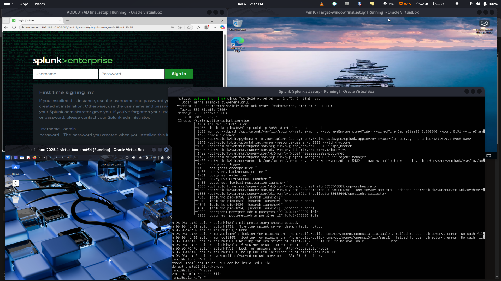

# Active Directory SOC Automation

<figure><figcaption></figcaption></figure>

### Description

You will build a Windows Active Directory domain in Azure, monitor it using Splunk (SIEM), and automate security responses using Shuffle (SOAR). The core goal is to detect unauthorized logins and trigger an automated workflow that notifies an analyst via Slack, allowing them to disable the compromised user account with a single click.

#### Core Components

* Identity: Windows Server (Active Directory) & Windows 10/11 Endpoints.
* Visibility: Splunk (Ingesting logs from Azure VMs).

#### 1. Technical Architecture

* Cloud Provider: Azure (chosen for cloud-based VMs and firewall management)
* I chose Local Environment.
* Domain Controller: Windows Server (Active Directory Domain Services) .
* Target Endpoint: Windows 10/11 workstation joined to the domain.
* SIEM: Splunk (installed on an Ubuntu Server).

**Phase 1: Network Diagramming**&#x20;

* Goal: Visualize the traffic flow from the Windows endpoints to the SIEM.
* Tools: Lucidchart or Draw.io.

**Phase 2: VMs Infrastructure**&#x20;

* Provision virtual machines (VMs).
* Firewall Configuration: Set specific rules to allow Splunk to ingest logs and Shuffle to communicate with the Domain Controller.

**Phase 3: SIEM & Sysmon Configuration & Detection**

* Ingestion: Set up Universal Forwarders on Windows machines to send logs to the Splunk Ubuntu server, and install sysmon to both windows machine.
* Detection Logic: Create a Splunk alert to detect "Unauthorized Successful Logins" (e.g., logins from unexpected IPs or after-hours).

**Phase 4: Active Directory Setup**

* Promote Windows Server to a Domain Controller.
* Configure a target workstation and join it to the domain.
* Create test user accounts to simulate logins.

**Phase 5: SOAR Automation (The "SOC" Workflow)**

* Workflow: brute force  ⇒ brute force detection ⇒ necessary steps taken

#### 3. Key Skills Demonstrated

* Cloud Administration: Managing VPCs and Firewalls.
* Identity Management: Active Directory administration.
* Security Monitoring: SIEM (Splunk) log analysis and query building (SPL).

