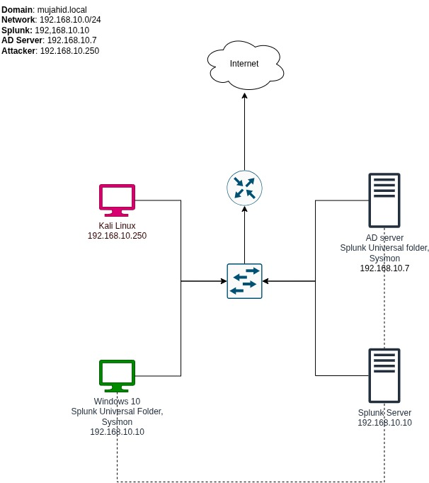

# Phase 1 - Diagram

#### 1. Project Overview & Goals

The goal of this project is to build a fully functional on-premise domain environment from scratch.

* Skills Learned: Installing and configuring Active Directory, Splunk, and Windows machines.
* Career Value: This is a project that can be discussed during job interviews to demonstrate hands-on experience.

#### 2. Hardware & Software Requirements

Before building, you must ensure your hardware can handle the virtualization.

* Recommended Specs: At least 16GB of RAM and 250GB of disk space.
* Virtualization Software: \* Windows Users: The walkthrough uses VirtualBox .
  * Mac Users (M1/M2/M3): Because standard virtualization has compatibility issues with these chips, it is recommended to use a cloud provider like Azure or Vultr.

#### 3. Lab Architecture (The Diagram)

The instructor uses draw.io to map out the network. This helps in understanding data flow and is a common task during technical interviews.

**Network Configuration**

* Domain Name: mujahid`.local`&#x20;
* Network Range: `192.168.10.0/24`&#x20;

**The Components**

1. Splunk Server: \* IP: `192.168.10.10`
   * Purpose: Centralized log management and analysis .
2. Active Directory (AD) Server:
   * IP: `192.168.10.0`
   * Tools: Will have Sysmon (for telemetry) and Splunk Universal Forwarder (to send logs to Splunk).
3. Target Machine (Windows 10):
   * IP: DHCP assigned.
   * Tools: Sysmon, Splunk Universal Forwarder, and Atomic Red Team (to generate attack data).
4. Attacker Machine (Kali Linux):
   * IP: `192.168.10.250`.
5. Infrastructure Icons: The diagram also includes an L2 Switch, a Router, and a Cloud icon to represent the internet connection.

#### 4. Key Takeaways for Setup

* Visualizing Data Flow: In the diagram, dotted green lines are used to represent the forwarding of logs from the AD and Windows 10 machines to the Splunk server.
* Documentation: Even if the diagram isn't "pretty," having it documented is essential for referencing as you build the lab in later steps.

#### Here is the Diagram of our project

<figure><figcaption></figcaption></figure>



<strong>This is if for this phase, now we will move to the next phase</strong> 


