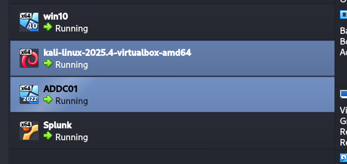

# Phase 5 - Attacking Phase

#### Key ideas & Objectives

* **Perform a Brute Force Attack**: Use Kali Linux and a tool called Crowbar to perform a Brute Force attack against a Windows Target machine via the Remote Desktop Protocol (RDP).
* **Analyze Telemetry in Splunk**: Use Splunk to query and identify the "logs" left behind by the attack, specifically looking for event IDs like 4625 (failed logon) and 4624 (successful logon) to see what a real attack looks like in a monitoring environment.
* **Implement Atomic Red Team**: Install the Atomic Red Team framework on the victim machine to run scripted tests that map to the MITRE ATT\&CK framework.
* **Identify Visibility Gaps**: Use those automated tests to determine if your current logging and monitoring setup can actually "see" certain attacker behaviors (like creating a new local user) and learn how to close those gaps in visibility.

#### &#x20;Perform a Brute Force Attack

1.  Spin up all 4 machines, hell you will run out of you RAM, so feel free to reduce machine RAM allocation. 

    
<figure><figcaption></figcaption></figure>

2.  Now set up kali static IP address as per our diagram\
     

    <figure><figcaption></figcaption></figure>

    1. Disconnect the Ethernet and reconnect and then check ip is now set up 
3. now update and upgrade Kali repo by `sudo apt-get update && sudo apt-get upgrade -y`  &#x20;
4. creating directory called ad-project
   1.  we will use rockyou.txt for the brute force lets cut 20 pass in ad-project and add our password in the file 

       <figure><figcaption></figcaption></figure>

       <figure><figcaption></figcaption></figure>
5. Install crowbar in kali `sudo apt install crowbar`&#x20;
6. Enable RDP on target machine
   1.  got to about(settings) > advance system settings > login as administrator > go to remote tab > allow remote connection to this computer > select user > type names and click for check names 

       <figure><figcaption></figcaption></figure>
7.  Start attack

    1.  for some reason crowbar not working so i'll use hydra 

        <figure><figcaption></figcaption></figure>

        `hydra -l jsmith -P passwords.txt rdp://192.168.10.100`\
        `invent code 4625 mean faild logon`

This is how our lab is ready and we have a full home lab setup for AD + Splunk, we can do alot more thing analyse automate and many more





<strong>Congratulations We completed our Project</strong>


